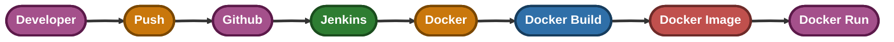

# nodejs-project

```mermaid
flowchart LR
    A(["Developer"]) ==> B(["Push"]) ==> C(["Github"])
    C ==> F(["Jenkins"])
    F ==> E(["Docker"]) ==> D(["Docker Build"])
    D ==> G(["Docker Image"]) ==> H(["Docker Run"])

    classDef pink fill:#a4508b,stroke:#5c1a4a,stroke-width:3px,color:#fff,font-weight:bold
    classDef orange fill:#c9770c,stroke:#7a4700,stroke-width:3px,color:#fff,font-weight:bold
    classDef green fill:#2e7d32,stroke:#1b4d1e,stroke-width:3px,color:#fff,font-weight:bold
    classDef blue fill:#2f6fa8,stroke:#173d5e,stroke-width:3px,color:#fff,font-weight:bold
    classDef red fill:#c0504d,stroke:#6e2b29,stroke-width:3px,color:#fff,font-weight:bold

    class A,C,H pink
    class B,E orange
    class F green
    class D blue
    class G red
```
